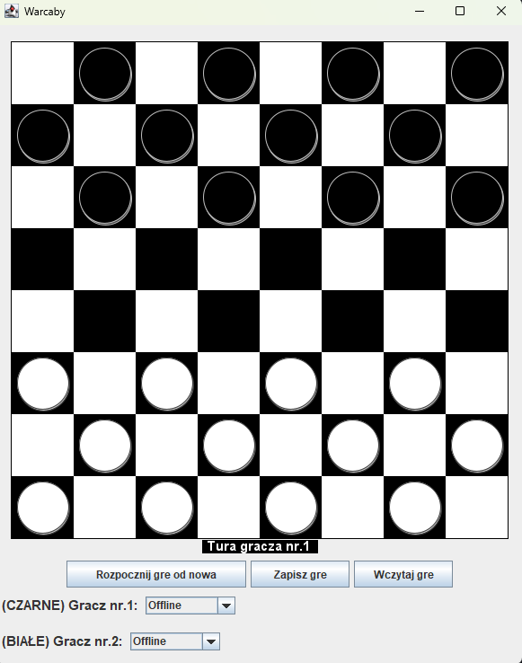
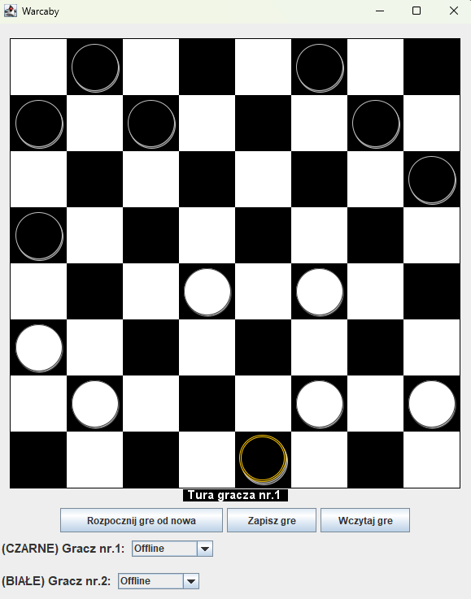

# ♟️ Warcaby Java

Aplikacja desktopowa w języku **Java**, umożliwiająca grę w warcaby dla dwóch graczy lokalnie. Projekt został stworzony w ramach zajęć **Programowanie zaawansowanych aplikacji w JAVA**.

---

## 🧰 Technologie

- Java 8+
- Swing (graficzny interfejs użytkownika)
- NetBeans
- Apache Ant (kompilacja i uruchamianie)

---

## 🎮 Funkcje gry

- ✅ Tryb lokalny: Gracz vs Gracz
- ✅ Plansza 8x8 z graficzną obsługą pionków
- ✅ Ruchy po skosie, bicie i promocja na damkę
- ✅ Komunikaty o zakończeniu gry
- ✅ Resetowanie rozgrywki

---

## ▶️ Jak uruchomić projekt

### 🔹 W NetBeans:
1. `File → Open Project`
2. Wskaż folder projektu (zawiera `build.xml`)
3. Kliknij prawym na nazwie projektu → `Run` (lub naciśnij `F6`)

### 🔹 Alternatywnie z terminala (jeśli masz Apache Ant):
```bash
ant run
```

---

## 🖼️ Screenshoty

Widok gry przy starcie aplikacji:
- 

Widok gry podczas rozgrywki:
- 

## 👨‍💻 Autor

**Kacper Kałużny** ([Example7](https://github.com/Example7))  
